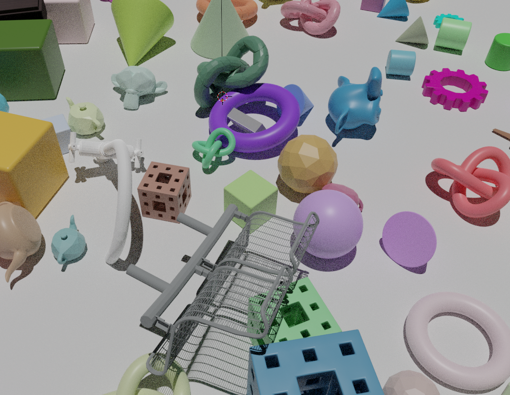
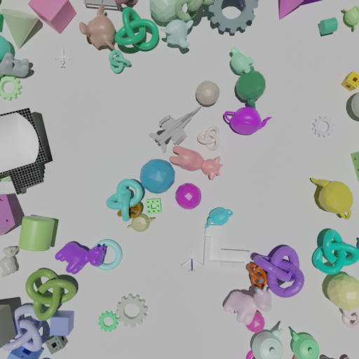

# Data Generator 3D

Generating high-quality synthetic datasets for 3D instance segmentation using Kubric.

## Installation
1. Kubric  
Install Kubric using docker (https://github.com/google-research/kubric)
```
git clone https://github.com/google-research/kubric.git
cd kubric
docker pull kubricdockerhub/kubruntu
```

2. Git clone `data_generator_3d` into the kubric directory, `\kubric`
```
git clone https://github.com/ZhiangChen/data_generator_3d.git
```

3. Install dependencies
```
pip install open3d laspy
```

## Usages
1. Generate 3D objects:
```
docker run --rm --interactive \
           --user $(id -u):$(id -g) \
           --volume "$(pwd):/kubric" \
           kubricdockerhub/kubruntu \
           /usr/bin/python3 data_generator_3d/generate_data.py
```

2. Extract each mesh from semantic_SfM.blend:
```
docker run --rm --interactive \
           --user $(id -u):$(id -g) \
           --volume "$(pwd):/kubric" \
           kubricdockerhub/kubruntu \
           /usr/bin/python3 data_generator_3d/blender2mesh.py
```

3. Generate pointcloud from meshes:
```
python3 data_generator_3d/mesh2pointcloud.py
```

## Features
Mesh scene:  


RGB image:  


Depth image:  


Segmentation:  


Pointcloud:  


    
Rendering multiple camera photos from a lawnmower sweep pattern to simulate UAV imagery. Users can adjust camera parameters:
- flying height
- front overlap
- side overlap
- tilting angle

## Shapenet depth rendering issue
When an object from the Shapenet has transparent materials or thin, pointed parts, Kubric has a problem of rendering depth images, resulted in very large values. I did not fix this problem in Kubric. Instead, I create a script to select those objects without the depth rendering issue. 

a. Select valid shapenet objects:
```
docker run --rm --interactive \
           --user $(id -u):$(id -g) \
           --volume "$(pwd):/kubric" \
           kubricdockerhub/kubruntu \
           /usr/bin/python3 data_generator_3d/utils/shapenet_selector.py
```

b. Visualize selecte shapenet objects:
```
docker run --rm --interactive \
           --user $(id -u):$(id -g) \
           --volume "$(pwd):/kubric" \
           kubricdockerhub/kubruntu \
           /usr/bin/python3 data_generator_3d/utils/visualize_shapenet.py
```

The repository includes a list of pre-selected shapenet objects in `selected_shapenet_objects.txt`. 